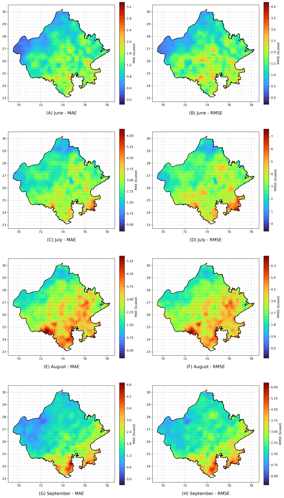
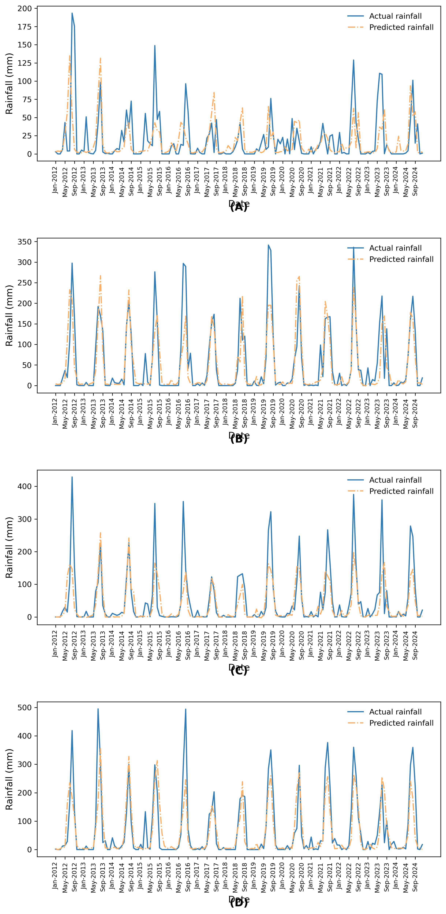

# PrecisionRain: Spatial-Temporal Precipitation Forecasting 

## Overview
PrecisionRain is a deep learning framework designed to forecast monthly precipitation levels using spatial-temporal meteorological data. The system models complex weather patterns by combining robust data processing pipelines with a hybrid CNN-LSTM neural network architecture. 

The evaluation is focused on the Rajasthan region, chosen because its stark gradient from arid desert to sub-humid zones provides a highly challenging and ideal environment for testing the model's accuracy and robustness across diverse climatic conditions. 

This project emphasizes end-to-end model development, from processing large-scale geospatial datasets to rigorous performance tracking and visualization.

## Results & Visualizations
Embedding your visualizations directly in the documentation provides immediate validation of the model's performance to anyone reviewing the repository.

### Spatial Drift Monitoring (MAE & RMSE)


### Temporal Trend Validation


### Quantitative Evaluation
**1. Regional Monsoon Forecasting Performance (Scaled Metrics)**
The CNN-LSTM model was rigorously evaluated across four distinct geographic coordinate zones representing the stark climatological diversity of Rajasthan.

| Geographic Zone | Target Coordinates | June (MAE / RMSE) | July (MAE / RMSE) | August (MAE / RMSE) | September (MAE / RMSE) |
|:---|:---|:---:|:---:|:---:|:---:|
| **North-West Desert** | 29°00'N 73°00'E | 0.7626 / 1.0381 | 1.4644 / 1.9026 | 1.6116 / 1.9294 | 1.1564 / 1.7826 |
| **Central Aravalli Hill** | 26°00'N 74°50'E | 1.0964 / 1.5918 | 2.9588 / 3.5668 | 2.1056 / 2.6489 | 1.7087 / 2.0427 |
| **Eastern Plain** | 26°50'N 75°00'E | 1.2258 / 1.5332 | 3.4422 / 4.3144 | 2.9036 / 3.8176 | 1.3978 / 1.7432 |
| **South-Eastern Plateau** | 25°25'N 75°50'E | 1.3143 / 1.7798 | 2.9669 / 3.8248 | 3.4997 / 4.2339 | 2.5602 / 3.0543 |

**2. Overall Month-Wise Observability (All Regions Combined)**
Aggregated performance tracking across all operational grids.

| Month | Data Points Evaluated | MAE (Scaled) | RMSE (Scaled) |
|:---|:---:|:---:|:---:|
| **June** | 13,104 | 1.1240 | 1.6825 |
| **July** | 13,104 | 2.3683 | 3.3940 |
| **August** | 13,104 | 2.4494 | 3.3905 |
| **September**| 13,104 | 1.7149 | 2.6352 |

## Key Features & Architecture
- **Vectorized Data Pipelines:** Engineered high-performance, fault-tolerant ingestion pipelines for large-scale NetCDF datasets utilizing `xarray` and `dask` for distributed chunking.
- **CNN-LSTM Architecture:** Designed a modular Deep Learning architecture combining 1D Convolutional Neural Networks (CNNs) for spatial-temporal feature extraction with Long Short-Term Memory (LSTM) layers for capturing long-term sequential dependencies and nonlinear climatological relationships.
- **AI Quality & Observability:** Implemented comprehensive testing and observability frameworks to validate AI-generated predictions against standard metrics, measuring drift (MAE, RMSE) across diverse temporal and spatial domains.
- **Spatial Visualization & Reporting:** Developed automated Python scripts for generating geospatial heatmaps and comparative metrics, effectively bridging the gap between raw tensor outputs and actionable business/climatological insights.

## Dataset & Feature Engineering
- **Source Data:** The model ingests 73 years of India-wide NetCDF spatial-temporal datasets, converting raw climate inputs into high-resolution (0.25° × 0.25°) feature grids.
- **Geospatial Scope:** Granularly filtered for the Rajasthan region (Latitude: 23.08°N – 30.24°N, Longitude: 69.45°E – 78.32°E).
- **Feature Space:** Key tensors include precipitation (`rain`), temperature ranges (`tmax`, `tmin`, `tmean`, `t_range`), lag features (`rain_lag_1`), and cyclically encoded seasonality (`month_sin`, `month_cos`).
- **Data Transformation:** Automated ingestion pipelines apply `RobustScaler` for anomaly resistance and chunk sequential data into 108-timestep sequences (representing 9-year chronological context windows).

## Evaluation Metrics & Validation
To ensure high fidelity in production, model quality is rigorously tested across four distinct climatic zones (North-West Desert, Central Aravalli, Eastern Plain, South-Eastern Plateau).
- **Loss Function:** Optimized via Huber loss for robustness against extreme weather outliers, maintaining stable gradients during backpropagation.
- **Primary Metrics:** Model drift and spatial accuracy are assessed using **Mean Absolute Error (MAE)** and **Root Mean Squared Error (RMSE)**.
- **Temporal Focus:** Validation specifically targets peak monsoon months (June through September) where forecasting accuracy is business-critical.

## Hardware & Infrastructure Leverage
To process high-dimensional spatial-temporal sequences and accelerate deep learning workloads, this project was executed leveraging my university's high-performance computing infrastructure:
- **Server:** Nvidia DGX-1 
- **Compute:** Dual 20-core Intel Xeon E5-2698 v4 @ 2.2 GHz processor
- **System Memory:** 512 GB DDR4 RAM
- **AI Acceleration:** 256 GB (8 × 32 GB) distributed GPU memory

## Repository Structure
```text
.
├── data/                           # Directory for datasets and shapefiles (e.g., India_Meteo_Combined_Final.nc)
├── src/
│   ├── train.py                    # Optimized CNN-LSTM AI training with early stopping & guardrails
│   ├── evaluate.py                 # AI quality metrics generation (MAE, RMSE tracking)
│   ├── visualize_spatial.py        # Spatial drift monitoring and heatmap generation
│   └── visualize_temporal.py       # Temporal trend observability and validation
├── images/                         # Geospatial plots and evaluation artifacts
├── requirements.txt                # Python dependencies
└── README.md
```

## Setup & Deployment

### 1. Environment Configuration
Clone the repository and install the required dependencies inside an isolated virtual environment:
```bash
git clone <your-repository-url>
cd PrecisionRain
python -m venv venv
source venv/bin/activate  # On Windows use `venv\Scripts\activate`
pip install -r requirements.txt
```

### 2. Data Acquisition (IMD Dataset)
Because the dataset spans 73 years and is too large for version control, you must provision the raw data locally. 
1. **Download Gridded Data:** Visit the [India Meteorological Department (IMD) Data Portal](https://imdpune.gov.in/) and download the high-resolution (0.25° × 0.25°) gridded binary datasets for Rainfall and Temperature (Min/Max).
2. **Conversion:** Convert the raw IMD binary files into a combined NetCDF format (`.nc`). It is recommended to use `xarray` or CDO (Climate Data Operators) tools for this conversion. 
3. **File Placement:** Save the compiled NetCDF file as `India_Meteo_Combined_Final.nc` and place it strictly inside the `data/` directory.

### 3. Shapefiles for Spatial Masking (Optional)
To generate the masked spatial heatmaps, you will need the Indian states shapefile.
1. Download a standard administrative shapefile for India.
2. Place the extracted files (including `.shp`, `.shx`, `.dbf`) into the `data/shapefiles/` directory, ensuring the main file is named `Indian_States.shp`.

## Operational Workflow

**1. Model Training & Pipeline Execution:**
Execute the optimized CNN-LSTM training pipeline, which handles automated data chunking, feature scaling, and tensor processing:
```bash
python src/train.py
```

**2. AI Quality Evaluation:**
Trigger the validation pipeline to evaluate the trained model on test sequences, reporting scaled Mean Absolute Error (MAE) and Root Mean Squared Error (RMSE) across critical temporal segments:
```bash
python src/evaluate.py
```

**3. Observability & Visualization:**
Generate artifacts for drift monitoring and performance evaluation:
```bash
python src/visualize_spatial.py
python src/visualize_temporal.py
```

## License
MIT License
